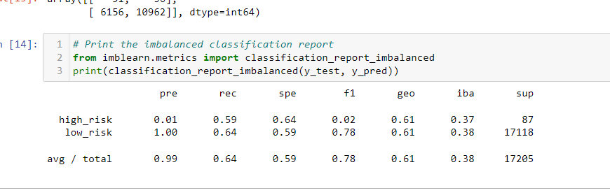
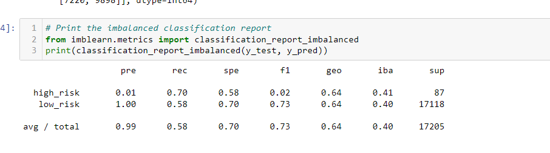
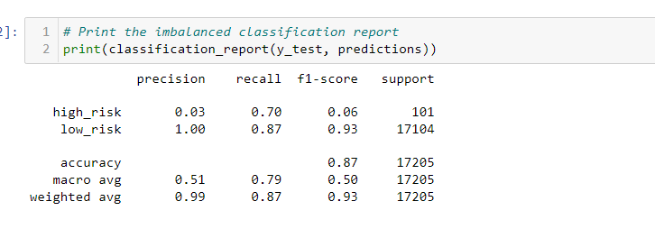
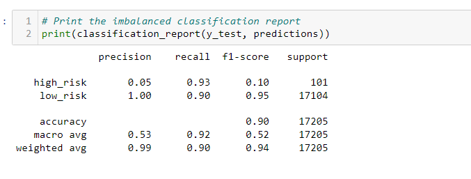

# Credit_Risk_Analysis
## Overview
The purpose of this analysis was to create a machine learning environment to automatically tell us if a particular client of a credit applicant would contain risk.Through testing and training the data the machine learning environment would then be able to predict properly if a client was risky or not.

## Results
Below we see the results of our analysis.
*  Naive Random Oversampling 
Naive Random Oversampling produced a balanced accuracy score of .57 for our testing dataset. We also see from our screenshot below that this produced a high_risk precision of .01 and a low risk precision of 1 for this model. The recall values for high were .52 and the low were .64. 

* SMOTE Oversampling
SMOTE Oversampling produced a balanced accuracy score of .62 for our testing dataset. We also see from our screenshot below that this produced a high_risk precision of .01 and a low risk precision of 1 for this model. The recall values for high were .61 and the low were .64. 

*   Undersampling
Undersampling produced a balanced accuracy score of .59 for our testing dataset. We also see from our screenshot below that this produced a high_risk precision of .01 and a low risk precision of 1 for this model. The recall values for high were .71 and the low were .40. 

*   Combination Sampling

Combination produced a balanced accuracy score of .55 for our testing dataset. We also see from our screenshot below that this produced a high_risk precision of .01 and a low risk precision of 1 for this model. The recall values for high were .72 and the low were .58. 

*   Balanced Random Forest Classifier
Combination produced a balanced accuracy score of .99 for our testing dataset. We also see from our screenshot below that this produced a high_risk precision of .85 and a low risk precision of 1 for this model. The recall values for high and low were 1.

*   Easy ensemble adaboost
Easy ensemble produced a balanced accuracy score of 1 for our testing dataset. We also see from our screenshot below that this produced a high_risk precision of 1 and a low risk precision of 1 for this model. The recall values for high and low were also 1.

## Summary
Overall it would appear that the ensemble based models produced more accurate tests coming in right around 99% for both tests. This almost perfect model seems unreal, so i would suggest performing further analysis on the data to see if they produced an accurate high_risk vs. low_risk credit profiles. The model that produced the lowest accuracy was the combination sampling coming in at .55. The best recommendation that I have for this particular analysis would be to train this data a bit more and have the highest resampling model perform more fitting, that would be the Undersampling, also for this particular dataset, giving people the oppurtunity for credit is not always a bad thing, people can be outliers.